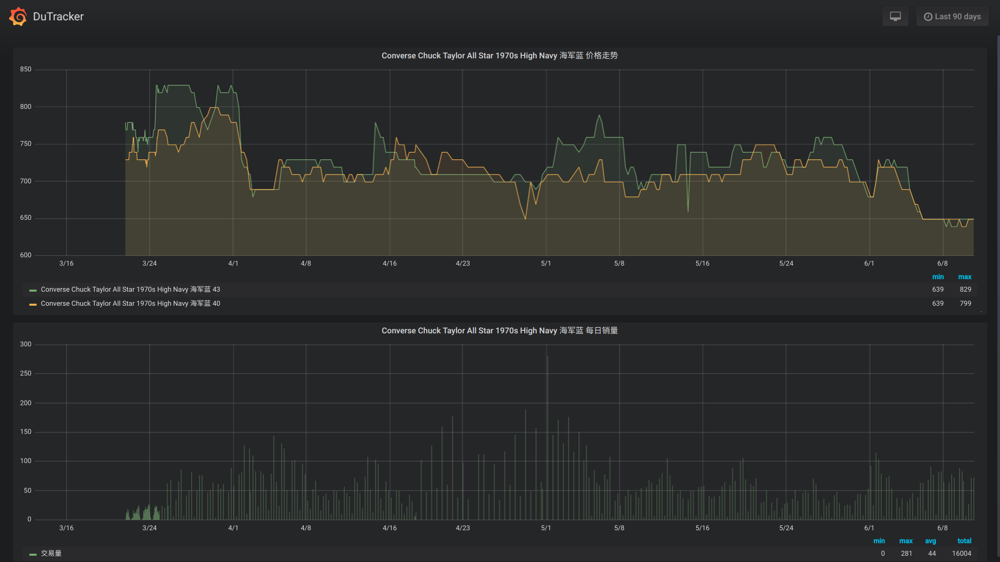

<h1 align="center">DuTracker</h1>


### 毒接口已更新，此项目已失效，需要更新

> 现在上班了，等有空再更新😕

---


本项目旨在追踪 [毒-运动x潮流x装备](http://m.poizon.com/website/pc)各个商品价格变化



## Requires

- python requirements `pipenv install`
- docker envirements `docker-compose up -d`
    - [wildcat/scylla](https://github.com/imWildCat/scylla)(默认未开启) Scylla 是一款高质量的免费代理 IP 池工具
    - [docker.io/influxdb:latest](https://docs.docker.com/samples/library/influxdb/) 开源时序数据库
    - [grafana/grafana](https://github.com/grafana/grafana) 时序数据展示平台

## Getting started
1. `docker-compose up -d`启动程序
2. 访问:`http://localhost:3000/`配置influxDB,如图:

3. 从[template.json](./template.json)导入DashBoard
4. 利用抓包工具获取 *毒App内:购买-分类-品牌/系列-任意子项(Nike,Converse)* 访问的URL,替换`DuTracker/utils/urls.py`中的信息

## Usage

- 导入需要追踪的商品ID
    - 导入指定商品ID  `python dt.py addproduct 1 2 3`
    - 导入指定品牌、系列所有附属商品
        - [更新 `DuTracker/utils/urls.py`信息](#url更新方式)
        - `python dt.py crawl`
- 追踪商品价格趋势
    - `python dt.py start -v`
    - 自动更新指定品牌、系列包含商品 `python dt.py start -v  -b 176 -s 53`
    - 追踪销量高于 xx 的商品 `python dt.py start --min xx`
    - 通过**scylla**代理 `python dt.py start -v --proxy http://127.0.0.1:8081`
- Grafana配置
    - 添加InfluxDB 数据源
    - 从[template.json](./template.json)导入DashBoard

## FAQ

### URL更新方式

利用**Fildder** 获取 *毒App内:购买-分类-品牌/系列-任意子项(Nike,Converse)* 访问的URL,替换`DuTracker/utils/urls.py`中的信息

### grafana docker 启动失败

查看容器log得到以下信息

```bash
# docker logs dutracker_ui_1
GF_PATHS_DATA='/var/lib/grafana' is not writable.
You may have issues with file permissions, more information here: http://docs.grafana.org/installation/docker/#migration-from-a-previous-version-of-the-docker-container-to-5-1-or-later
mkdir: cannot create directory '/var/lib/grafana/plugins': Permission denied
```

Solution:

```bash
chmod -R 777 volumes/grafana
docker start dutracker_ui_1
```
